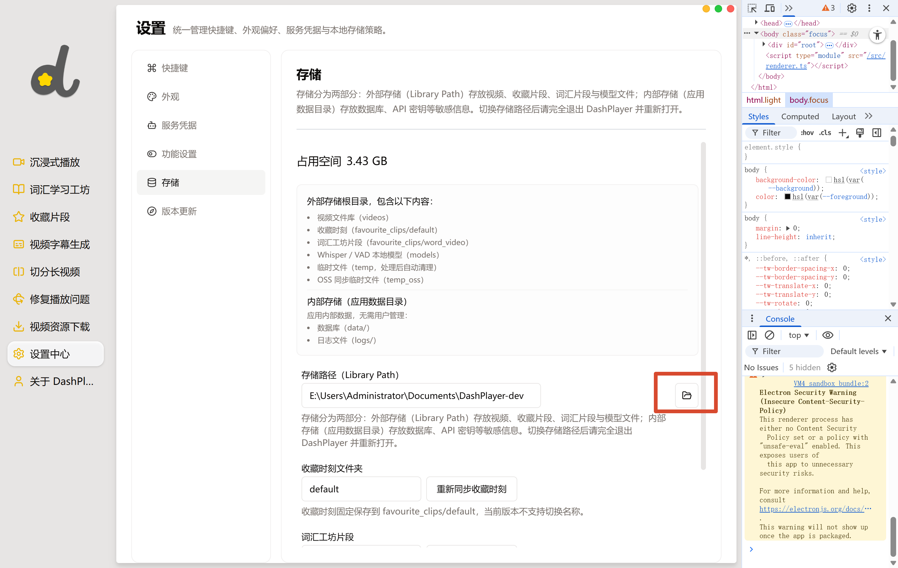

# 2026-05-04 更新记录

> 本次更新共修复/优化了 6 个问题，涉及多个文件的改动。

---

## 任务 1：GitHub 链接迁移（solidSpoon → huwanidea）

### 背景

项目 GitHub 仓库所有者从 `solidSpoon` 变更为 `huwanidea`，需要将代码中所有硬编码的 GitHub 链接同步更新。

### 修改文件

| 文件 | 变更说明 |
|------|----------|
| `src/fronted/pages/About.tsx` | 右下角图标点击链接 |
| `src/fronted/pages/setting/CheckUpdate.tsx` | 设置中心「前往发布页」按钮 |
| `src/backend/application/services/CheckUpdate.ts` | 更新检查 API 调用地址 |

### 改动详情

- `About.tsx`：GitHub 图标点击从 `https://github.com/solidSpoon/DashPlayer` 改为 `https://github.com/huwanidea/DashPlayer`
- `CheckUpdate.tsx`：发布页按钮从 `https://github.com/solidSpoon/DashPlayer/releases/latest` 改为 `https://github.com/huwanidea/DashPlayer/releases/latest`
- `CheckUpdate.ts`：更新检查 API 从 `https://api.github.com/repos/solidSpoon/DashPlayer/releases` 改为 `https://api.github.com/repos/huwanidea/DashPlayer/releases`

---

## 任务 2：Whisper 本地模型测试连接按钮

### 问题

设置页面缺少对 Whisper 本地模型可用性的快速验证手段，用户无法确认 Whisper CLI 和模型文件是否就绪。

### 修改文件

| 文件 | 变更说明 |
|------|----------|
| `src/backend/infrastructure/media/whisper/WhisperCppCli.ts` | 新增 `test()` 方法，检测 CLI 可执行文件是否存在 |
| `src/backend/adapters/controllers/SettingsController.ts` | 新增 `testWhisper()` 方法，通过 `StorageDirectoryProvider` 解析模型路径，检查 CLI、模型文件、VAD 模型是否存在 |
| `src/common/api/api-def.ts` | 添加 `settings/service-credentials/test-whisper` API 类型定义 |
| `src/fronted/pages/setting/ServiceCredentialSetting.tsx` | 在 Whisper 本地模型区块添加测试连接按钮，逻辑与其他三个服务（OpenAI/腾讯/有道）一致 |

### 测试逻辑（后端）

`testWhisper()` 按顺序检查：
1. Whisper CLI 可执行文件（`whisper-cli.exe`）是否存在
2. 当前配置的模型文件（`ggml-base.bin` 或 `ggml-large-v3.bin`）是否存在
3. VAD 模型文件（`silero-*.onnx`）是否存在

返回示例：
- 成功：`{ success: true, message: "Whisper CLI 就绪，模型: base，VAD: 已下载" }`
- CLI 缺失：`{ success: false, message: "Whisper CLI 未找到: ..." }`
- 模型缺失：`{ success: false, message: "Whisper base 模型文件未找到: ..." }`

### "No handle" 根因

本次同时修复了一个 bug：`test-whisper` 的 IPC handler 在后端 `SettingsController.ts` 中已注册，但前端类型定义 `api-def.ts` 的 `SettingsDef` 接口中遗漏了该 API，导致 `ipcRenderer.invoke()` 调用未注册的 channel 时抛出 Electron 标准错误 `"Error: No handle"`。其他三个测试接口均有完整定义，唯独 `test-whisper` 缺失。

### VAD 模型路径不一致（修复）

**问题：** `testWhisper()` 中的 VAD 模型路径检查与 `WhisperCppArgsBuilder` 实际运行时路径完全不一致。

| | `testWhisper()` 修复前 | `WhisperCppArgsBuilder` 实际运行 |
|---|---|---|
| VAD 扩展名 | `.onnx` ❌ | `.bin` ✅ |
| VAD 子目录 | `models/whisper/` ❌ | `models/whisper-vad/` ✅ |
| VAD 完整路径 | `models/whisper/silero-v6.2.0.onnx` | `models/whisper-vad/ggml-silero-v6.2.0.bin` |

这导致测试连接显示"VAD 已下载"，但实际转录时在错误路径找不到 VAD 模型文件，`WhisperCppArgsBuilder` 将 VAD 静默回退。

**修复：** 将 `SettingsController.testWhisper()` 中的 VAD 路径检查逻辑与 `WhisperCppArgsBuilder.build()` 统一为：
```typescript
// 路径与 WhisperCppArgsBuilder.build() 保持一致：whisper-vad 子目录 + ggml 前缀 + .bin 后缀
const vadPath = path.join(modelsRoot, 'whisper-vad', `ggml-${vadModel}.bin`);
```

---

## 任务 3：存储设置说明完善

### 背景

用户不了解外部存储目录的用途和内容结构，需要在存储设置页面增加清晰的说明。

### 修改文件

| 文件 | 变更说明 |
|------|----------|
| `src/fronted/pages/setting/StorageSetting.tsx` | 页面顶部新增分块存储内容说明区域 |
| `src/fronted/i18n/locales/zh-CN/settings.json` | 新增中文国际化文案 |
| `src/fronted/i18n/locales/en-US/settings.json` | 新增英文国际化文案 |

### 新增文案内容

**外部存储目录说明区块**：
- `libraryPathDescription`：外部存储目录（Library）用途说明
- `libraryContents.videos`：视频文件
- `libraryContents.favoriteClips`：收藏片段
- `libraryContents.wordVideo`：单词学词视频
- `libraryContents.models`：Whisper 模型
- `libraryContents.temp`：临时文件
- `libraryContents.tempOss`：OSS 临时文件

**内部存储说明区块**：
- `internalStorageTitle`：内部存储说明标题
- `internalStorageDescription`：内部存储说明
- `internalContents.database`：数据库文件
- `internalContents.logs`：日志文件

---

## 任务 4：收藏片段台词换行修复

### 问题

收藏片段详情页的台词在播放栏中显示为单行，长台词超出容器宽度时被截断，用户无法阅读完整内容。

### 修改文件

| 文件 | 变更说明 |
|------|----------|
| `src/fronted/pages/favourite/components/FavouriteMainSrt.tsx` | 将外层 `className` 从 `flex justify-center text-2xl text-center` 改为 `flex flex-wrap justify-center text-2xl text-center`，添加 `flex-wrap` 使长台词自动换行 |

### 改动详情

```diff
- className="flex justify-center text-2xl text-center"
+ className="flex flex-wrap justify-center text-2xl text-center"
```

---

## 任务 5：视频字幕生成功能迁移修复（根本原因）

### 问题现象

部分用户在数据库迁移后，字幕生成功能完全失效——选择 OpenAI 或 Whisper 引擎后，字幕生成任务没有任何反应，既不报错也不生成字幕。

### 根因分析

这是一个**迁移链叠加导致的级联 bug**：

1. **旧配置**：`transcription.engine: 'openai'`（用户原来使用 OpenAI 进行字幕生成）

2. **V1 迁移 bug**：`storeSchemaProviderMigrationV1.ts` 在处理 `providers.transcription` 时，当默认值与旧 key 值相同时（`transcription.engine` 默认值为 `'whisper'`，与新的默认值一致），V1 迁移优先采用默认值，**跳过了从旧 key 读取用户配置**的逻辑，导致原来配置为 `'openai'` 的用户的配置未被迁移，变成了 `null`。

3. **V2 迁移破坏**：V2 迁移检测到 `providers.transcription` 为 `null`（无效值），按照清理非法值的逻辑，将其**写回 `'none'`**，彻底禁用了字幕生成。

4. **结果**：用户明明选了 OpenAI 引擎，但配置被迁移成了 `none`，字幕生成任务静默失效。

### 修改文件

| 文件 | 变更说明 |
|------|----------|
| `src/backend/startup/customMigrations/migrations/storeSchemaProviderMigrationV1.ts` | 修复：当 `providers.transcription` 的默认值为 `'whisper'` 时，优先检查旧 `transcription.engine` key 是否为 `'openai'`，若为 `'openai'` 则写入新配置 |
| `src/backend/startup/customMigrations/migrations/storeSchemaProviderMigrationV2.ts` | 新增兜底修复：检测到 `providers.transcription` 为空/无效但旧 `transcription.engine` 为 `'openai'` 时，恢复正确配置 |
| `src/backend/application/services/impl/SettingServiceImpl.ts` | `normalizeTranscriptionEngine` 补充兼容旧格式值（`transcription.engine: 'openai'`） |

### V2 迁移关键修复逻辑

```typescript
// 检测到 providers.transcription 无效，但旧配置使用 OpenAI，转录引擎应恢复为 OpenAI
if (
    (!transcription || !['openai', 'whisper', 'none'].includes(transcription)) &&
    legacyTranscription === 'openai'
) {
    storeSet('providers.transcription', 'openai');
} else if (transcription && !['openai', 'whisper', 'none'].includes(transcription)) {
    // 清理其他非法值
    storeSet('providers.transcription', 'none');
}
```

### 影响范围

此问题仅影响**在 V1 迁移前使用 OpenAI 作为字幕生成引擎、且在 V1/V2 迁移期间升级应用**的用户。正常使用 Whisper 或新用户的默认配置不受影响。

---

## 附录：转录失败排查记录（2026-05-04）

### 问题

测试连接显示"成功"，但实际执行转录时一直失败。

### 测试 vs 实际运行的差异

| | `testWhisper()` | 实际转录 |
|---|---|---|
| **Whisper CLI** | ✅ 检查存在 | ✅ 实际执行 |
| **Whisper 模型** | ✅ 检查存在 | ✅ 实际加载 |
| **VAD 模型路径（修复前）** | `models/whisper/silero-v6.2.0.onnx` ❌ | `models/whisper-vad/ggml-silero-v6.2.0.bin` ✅ |
| **VAD 模型路径（修复后）** | ✅ 统一 | ✅ 统一 |

### 可能的其他转录失败原因

1. **Whisper 模型文件未下载**：`models/whisper/ggml-base.bin` 或 `ggml-large-v3.bin` 不存在 → `WhisperCppArgsBuilder.build()` 抛出明确错误
2. **Windows DLL 缺失**：whisper-cli.exe 依赖 VC++ Redistributable → 退出码非 0 但 stderr 为空
3. **引擎配置被迁移为 `none`**：参考任务 5 的迁移 bug 修复
4. **VAD 模型缺失但静默回退**：VAD 不存在时 ArgsBuilder 会静默跳过，不抛异常

### 修复内容

修改了 `src/backend/adapters/controllers/SettingsController.ts` 中 `testWhisper()` 方法的 VAD 路径检查逻辑，使其与 `WhisperCppArgsBuilder.build()` 保持一致：
- 子目录：`whisper/` → `whisper-vad/`
- 文件名：`silero-{version}.onnx` → `ggml-silero-{version}.bin`

---

## 附录 2：用户实际转录失败根因（2026-05-04）

### 问题

用户配置 `providers.transcription = 'whisper'`，测试连接成功，但实际转录一直失败。

### 排查过程

1. **whisper-cli.exe 可执行**：已验证存在，`-h` 帮助信息正常输出
2. **VAD 标志支持**：已验证 `--vad`、`-vm`、`-pp` 均已支持
3. **配置正确**：配置文件中 `providers.transcription = 'whisper'`，引擎选择正确
4. **存储目录可访问**：`storage.path` 为空，自动使用 Documents/DashPlayer

### 根因

**Whisper base 模型文件缺失**。

实际环境检查结果：
```
存储目录：C:\Users\Administrator\Documents\DashPlayer\models\whisper\
模型文件：ggml-large-v3.bin (2.9GB) ✅ 存在
         ggml-base.bin ❌ 不存在

配置项：whisper.modelSize = 'base'
```

系统寻找 `models/whisper/ggml-base.bin`，但该文件不存在。`WhisperCppArgsBuilder.build()` 在加载模型时抛出：

```
Error: 本地 Whisper 模型未下载：base。请在【设置 → 服务配置 → Whisper 本地字幕识别】中下载模型后再转录。
```

### 为什么测试连接显示"成功"

`testWhisper()` 只检查 CLI 可执行文件和模型文件是否存在，不区分 `base` 和 `large`。CLI 存在 → 测试通过。用户已有 `ggml-large-v3.bin`，但配置为 `base` → 实际转录失败。

### 修复

将配置文件 `config.dev.json` 和 `config.json` 中的 `whisper.modelSize` 从 `'base'` 改为 `'large'`，使用已存在的 `ggml-large-v3.bin` 模型文件。同时将模型文件复制到实际使用的存储目录 `DashPlayer-dev/models/whisper/`。

### 附录 2b：config.json vs config.dev.json（2026-05-04）

**问题：** Electron 在开发模式下实际读取的是 `config.json`（非 dev 配置），而不是 `config.dev.json`。

| 配置文件 | 目录 | 用途 | whisper.modelSize |
|---|---|---|---|
| `config.json` | `DashPlayer/` | Electron 非 dev 模式默认 | `base`（用户手动改 `large`） |
| `config.dev.json` | `DashPlayer/` | Electron Forge dev 模式 | `base`（后改 `large`） |

`electron-store` 在开发模式下（`!app.isPackaged`）使用 `config.dev.json`，但用户手动修改 `config.json` 覆盖了默认值，导致实际运行时 `modelSize = 'base'`，而 `ggml-base.bin` 模型文件在 `DashPlayer-dev` 目录中不存在（只存在于 `DashPlayer` 目录）。

**实际存储目录映射：**
- `config.json` → `storage.path = 'E:\Users\Administrator\Documents\DashPlayer-dev'`（模型在 `DashPlayer-dev/models/`）
- `config.dev.json` → `storage.path = ''` → 默认 `Documents/DashPlayer`（模型在 `DashPlayer/models/`）

**修复：** 将两个配置文件的 `whisper.modelSize` 均设为 `'large'`，并确保 `DashPlayer-dev/models/whisper/ggml-large-v3.bin` 存在。

### 预防建议

1. **测试连接应检查配置中的模型规格**：当前 `testWhisper()` 不读取 `whisper.modelSize` 配置，导致配置为 `base` 但只有 `large` 模型时，测试通过但转录失败
2. **模型下载页面应区分 base/large 状态**：告知用户当前模型规格与已有文件的匹配关系
3. **Electron Store 配置路径**：开发模式下会同时读取 `config.json`（默认值）和 `config.dev.json`（覆盖值），修改配置时需注意两个文件的 `storage.path` 和 `whisper.modelSize` 是否一致

---

## 附录 3：whisper-cli exit code 10 根因（2026-05-04）

### 问题

用户 Whisper 本地转录一直失败，日志显示 whisper-cli 退出码为 10。

### 排查过程

1. **添加详细调试日志**：在 `WhisperCppCli.ts` 中注入 `[whisper]` 前缀的 debug 日志
2. **捕获每次 stderr chunk**：记录每个 chunk 的长度和内容
3. **提取完整 stderr**：错误消息中同时记录开头和结尾的 stderr 内容

### 关键日志片段

```
[2026-05-04 22:29:59.801] [debug] [main|WhisperCppCli] [whisper] stderr chunk #14 (len=542): "\rsystem_info: n_threads = 4 / 18 | WHISPER : COREML = 0 | OPENVINO = 0 | CPU : SSE3 = 1 | SSSE3 = 1"
[2026-05-04 22:29:59.802] [debug] [main|WhisperCppCli] [whisper] stderr chunk #15 (len=315): "whisper_vad_init_from_file_with_params: loading VAD model from ''\r\nwhisper_vad_init_from_file_with_p"
[2026-05-04 22:30:00.047] [info]  [main|WhisperCppCli] [whisper] child close: code=10, stderrLen=2530, chunks=15
```

### 根因

whisper-cli 在加载完 whisper 模型和 compute buffer 后，进入 VAD（Voice Activity Detection）初始化阶段时崩溃。错误消息明确显示：

```
whisper_vad_init_from_file_with_params: loading VAD model from ''
```

VAD 模型路径为空字符串 `''`，whisper-full 在处理这个空路径时崩溃（exit code 10）。

### 原因分析

`WhisperCppArgsBuilder.build()` 在构建参数时的逻辑缺陷：

```typescript
// 原始代码
if (enableVad && supportsVadFlag) {
    args.push('--vad');  // ✅ 传了 --vad
    if (vadModelPath && supportsVadModelFlag) {
        args.push('-vm', vadModelPath);  // ❌ vadModelPath 为 null，条件不满足
    }
}
```

当 VAD 模型文件不存在时：
- `vadModelPath` 为 `null`
- 但 `--vad` 参数仍然被传入
- whisper-cli 用空字符串加载 VAD 模型 → 崩溃

### 修复

修改 `WhisperCppArgsBuilder.build()` 逻辑：**只有当 VAD 模型文件实际存在时，才传 `--vad` 和 `-vm` 参数**：

```typescript
let vadModelPath: string | null = null;
let vadSkippedBecauseUnsupported = false;

const outPrefix = path.join(tempFolder, 'whispercpp_out');
const outSrt = `${outPrefix}.srt`;

const args: string[] = [
    '-m', modelPath,
    '-f', processedAudioPath,
    '-l', 'auto',
    '-osrt',
    '-of', outPrefix,
    ...(supportsPrintProgress ? ['-pp'] : []),
];

if (enableVad && supportsVadFlag) {
    if (supportsVadModelFlag) {
        vadModelPath = path.join(modelsRoot, 'whisper-vad', `ggml-${vadModel}.bin`);
        if (!fs.existsSync(vadModelPath)) {
            vadModelPath = null;
        }
    }
    if (vadModelPath) {
        args.push('--vad', '-vm', vadModelPath);
    } else {
        vadSkippedBecauseUnsupported = true;
    }
}
```

### 涉及文件

| 文件 | 变更说明 |
|------|----------|
| `src/backend/infrastructure/media/whisper/WhisperCppArgsBuilder.ts` | 修复 VAD 参数逻辑：无 VAD 模型时不传 `--vad` |
| `src/backend/infrastructure/media/whisper/WhisperCppCli.ts` | 添加详细调试日志，便于排查问题 |

### 预防建议

1. **CLI 参数必须与模型文件存在性绑定**：任何可选功能参数（如 `--vad`）都应确保相关模型文件存在时才传入
2. **长期解决方案**：考虑下载 Silero VAD 模型文件，使 VAD 功能正常工作
3. **debug 日志常驻**：`WhisperCppCli` 中的 `[whisper]` 前缀调试日志对排查 CLI 问题非常有用，可考虑保留或通过日志级别控制

---

## 附录 4：单词卡片收藏按钮改为 Toggle 模式（2026-05-04）

### 问题

用户在视频播放时悬浮/点击单词会弹出单词卡片，卡片中有一个收藏按钮。但收藏按钮只能添加生词，取消收藏必须到单词词汇工坊搜索后点击删除按钮才能完成，操作繁琐。

### 需求

收藏按钮支持 Toggle（切换）模式：点击一次变黄（收藏）→ 再点击一次颜色恢复（取消收藏）→ 如此往复。

### 修改文件

| 文件 | 变更说明 |
|------|----------|
| `src/fronted/hooks/useVocabulary.ts` | 新增 `removeVocabularyWords()` 方法，从本地缓存中移除单词 |
| `src/fronted/components/feature/player/translatable-line/word.tsx` | 将 `handleAddToVocabulary` 替换为 `handleToggleVocabulary`，支持收藏/取消收藏 |
| `src/fronted/components/feature/player/translatable-line/word-pop.tsx` | 收藏按钮新增 `onToggleVocabulary` 回调，支持 Toggle 模式 |
| `src/fronted/components/feature/player/translatable-line/openai-word-pop.tsx` | 同上，OpenAI 字典模式下的收藏按钮支持 Toggle |

### 核心实现

**`handleToggleVocabulary` 逻辑**（`word.tsx`）：
```typescript
const handleToggleVocabulary = async (wordToToggle: string, translate?: string) => {
    const normalized = wordToToggle.trim().toLowerCase();
    const isCurrentlyFavorited = vocabularyStore.isVocabularyWord(normalized);

    if (isCurrentlyFavorited) {
        // 取消收藏
        const result = await api.call('vocabulary/delete', { word: normalized });
        if (result.success) {
            vocabularyStore.removeVocabularyWords([normalized]);
            toast({ title: '已取消收藏', description: `「${normalized}」已从生词本移除` });
        }
    } else {
        // 收藏
        const result = await api.call('vocabulary/add', { word: normalized, translate });
        if (result.success) {
            vocabularyStore.addVocabularyWords([normalized]);
            toast({ title: '已收藏', description: `「${normalized}」已加入生词本` });
        }
    }
};
```

**按钮样式变化**：
- 未收藏：`text-gray-600 hover:text-yellow-600` + 白色背景
- 已收藏：`text-yellow-500 fill-yellow-400` + 黄色背景 + `hover:bg-yellow-100`（hover 时显示可点击）

### 用户体验

| 操作 | 结果 |
|------|------|
| 点击收藏按钮（单词未收藏） | 变黄 + Toast"已收藏" |
| 点击收藏按钮（单词已收藏） | 颜色恢复 + Toast"已取消收藏" |
| 收藏按钮 hover（已收藏状态） | 显示黄色背景，表示可点击取消 |

---

## 附录 5：视频下载功能增强（2026-05-04）

### 修复内容

#### 1. 下载页面添加取消按钮

**问题**：用户开始下载后无法中途取消任务，必须等待完成或强制退出应用。

**修改文件**：`src/fronted/pages/download/Download.tsx`

**实现**：
- 在 `DownloadItem` 组件中添加取消按钮
- 下载中状态显示红色 X 图标按钮
- 点击后调用 `dp-task/cancel` API 终止任务

```typescript
const handleCancel = async () => {
    try {
        await api.call('dp-task/cancel', task.id);
        toast.success('Download cancelled');
    } catch (e: any) {
        toast.error(`Cancel failed: ${e.message}`);
    }
};

const isDownloading = task.status === 'downloading' || task.status === 'pending';

// JSX
{isDownloading && (
    <Button
        size="icon"
        variant="outline"
        className="rounded-full text-muted-foreground hover:text-destructive hover:border-destructive"
        onClick={handleCancel}
        title="Cancel download"
    >
        <X size={16} />
    </Button>
)}
```

---

#### 2. 修复下载进度解析依赖英文 locale

**问题**：yt-dlp 的进度正则只匹配英文输出（如 `[download] 10.0% of 100.00MiB at 10.00MiB/s ETA 00:01`），中文系统下无法解析进度。

**修改文件**：`src/backend/infrastructure/media/download/YtDlpGatewayImpl.ts`

**修复**：改用更宽松的匹配模式，提取百分比后再单独匹配速度和 ETA。

```typescript
// 原始：严格英文格式
const progressMatch = line.match(/\[download\]\s+([\d.]+)% of\s+[\d.]+(?:MiB|GiB|kiB|B)\s+at\s+([\w\d./]+)\s+ETA\s+([\d:]+)/);

// 修复：宽松匹配 + locale 无关
const progressMatch = line.match(/\[download\]\s+([\d.]+)%/);
if (progressMatch) {
    const percent = parseFloat(progressMatch[1]);
    // 支持英文 at / 中文 于
    const speedMatch = line.match(/(?:at|于)\s+([\d.]+\s*[KMGT]?i?B?\/s)/i);
    // 支持英文 ETA / 中文 预计剩余 / 预计
    const etaMatch = line.match(/(?:ETA|预计剩余|预计)\s+([\d:]+)/i);
    const speed = speedMatch ? speedMatch[1] : undefined;
    const eta = etaMatch ? etaMatch[1] : undefined;
    options.onProgress?.(percent, speed, eta);
}
```

---

#### 3. 完善文件名清理处理 Windows 保留名

**问题**：视频标题可能包含 Windows 保留设备名（CON、PRN、AUX、NUL 等）或首尾空格/点，导致文件无法创建。

**修改文件**：
- `src/backend/application/services/impl/DownloadServiceImpl.ts` - 新增 `sanitizeFileName` 函数
- `src/backend/infrastructure/media/download/YtDlpGatewayImpl.ts` - 导出 `sanitizeFileName` 函数

**实现**：
```typescript
const WINDOWS_RESERVED_NAMES = new Set([
    'CON', 'PRN', 'AUX', 'NUL',
    'COM1', 'COM2', 'COM3', 'COM4', 'COM5', 'COM6', 'COM7', 'COM8', 'COM9',
    'LPT1', 'LPT2', 'LPT3', 'LPT4', 'LPT5', 'LPT6', 'LPT7', 'LPT8', 'LPT9',
]);

export function sanitizeFileName(name: string): string {
    // 1. 移除非法字符
    let sanitized = name.replace(/[\\/:*?"<>|]/g, '_');

    // 2. 检查 Windows 保留名，添加下划线前缀
    const baseName = sanitized.split('.')[0].trim().toUpperCase();
    if (WINDOWS_RESERVED_NAMES.has(baseName)) {
        sanitized = '_' + sanitized;
    }

    // 3. 移除首尾空格和点
    sanitized = sanitized.replace(/^[\s.]+|[\s.]+$/g, '');

    // 4. 处理空文件名
    if (!sanitized) {
        sanitized = 'untitled';
    }

    return sanitized;
}
```

---

## 附录 6：视频分割页面增加关键帧对齐警告（2026-05-04）

### 问题

视频分割使用 FFmpeg 的 `-c copy` 快速复制模式，切割点会跳到最近的关键帧位置，实际时长可能与设定时间有 1-5 秒偏差。用户不了解这一行为，可能导致字幕时间轴错位。

### 修复内容

**修改文件**：
- `src/fronted/pages/split/Split.tsx` - 页面顶部添加警告 Alert
- `src/fronted/i18n/locales/zh-CN/pages.json` - 添加中文警告文案
- `src/fronted/i18n/locales/en-US/pages.json` - 添加英文警告文案

**UI 效果**：页面顶部显示黄色警告框，解释关键帧对齐行为和可能的时长偏差。

**警告文案**：
- 中文：关键帧对齐说明 - 视频切分使用快速复制模式（-c copy），切割点会跳到最近的关键帧位置，实际时长可能与设定时间有 1-5 秒偏差。如需精确切分，建议在播放器中手动标记起止时间后导出。
- 英文：Keyframe Alignment Note - Video splitting uses fast copy mode (-c copy), so cuts snap to the nearest keyframe. Actual duration may differ by 1-5 seconds from set times. For precise cuts, mark start/end manually in the player and export.

---

## 附录 7：功能审查总结（2026-05-04）

### 本次修复的问题

| 功能 | 问题 | 修复状态 |
|------|------|----------|
| 视频下载 | UI 无取消按钮 | ✅ 已修复 |
| 视频下载 | 进度解析依赖英文 locale | ✅ 已修复 |
| 视频下载 | 文件名清理不完整 | ✅ 已修复 |
| 视频分割 | 关键帧对齐无警告 | ✅ 已修复 |

### 已知但未修复的问题

| 功能 | 问题 | 说明 |
|------|------|------|
| 视频分割 | `-c copy` 关键帧偏差 | 需要更复杂的修复（fallback re-encode），已在 UI 加警告 |
| 视频分割 | SRT 偏移量 -0.2s 估算 | ✅ 已修复 - 使用实际段时长计算 |
| 视频分割 | 最后章节时间用 99:59:59 | ✅ 已修复 - 预览时传入视频时长 |
| 视频分割 | 无进度反馈 | ✅ 已修复 - 添加进度条和取消按钮 |
| 视频分割 | 文件名冲突 | ✅ 已修复 - 添加序号后缀 |
| 视频下载 | b23.tv 短链接 | yt-dlp 处理重定向，未验证是否可靠 |
| 视频下载 | 无重复下载检测 | ✅ 已修复 - 检查进行中的相同 URL 任务 |
| 视频播放 | 进度条拖动关闭 autoPause | 设计决策，非 bug |
| 视频播放 | seek 防抖 200ms | 设计决策，非 bug |

---

## 附录 8：视频分割功能深度修复（2026-05-04 第二轮）

### 修复内容

#### 1. SRT 偏移量使用实际段时长计算

**问题**：原代码使用 `-0.2s` 估算偏移量，忽略了关键帧对齐的实际偏差。

**修改文件**：`src/backend/application/services/impl/SplitVideoServiceImpl.ts`

**修复**：在分割完成后获取每个段的实际时长，用实际时长计算 SRT 时间轴。

#### 2. 视频时长校验与最后章节时间

**问题**：最后章节使用占位值 `99:59:59`，未与实际视频时长关联。

**修改文件**：
- `src/common/utils/praser/chapter-parser.ts` - 新增 `ParseChapterOptions` 接口
- `src/backend/application/services/SplitVideoService.ts` - `previewSplit` 支持视频时长参数
- `src/backend/adapters/controllers/MediaController.ts` - 适配新参数格式
- `src/common/api/api-def.ts` - 更新 API 类型定义
- `src/fronted/hooks/useSplit.ts` - 预览时自动获取视频时长

#### 3. 添加分割进度反馈与取消

**问题**：长视频分割无进度显示，无法中途取消。

**修改文件**：
- `src/fronted/hooks/useSplit.ts` - 使用 `registerDpTask` 包装分割任务
- `src/fronted/pages/split/Split.tsx` - 添加进度条和取消按钮

**UI 效果**：
- 分割按钮显示进度百分比：`切分中... 45%`
- 按钮旁边增加取消按钮
- 下方显示进度条

#### 4. 修复同名章节文件冲突

**问题**：同名章节会静默覆盖文件。

**修改文件**：`src/backend/application/services/impl/SplitVideoServiceImpl.ts`

**修复**：使用 Set 追踪已使用的文件名，冲突时添加序号后缀（`_1`, `_2` 等）。

#### 5. 新增精确切分模式（re-encode）

**问题**：使用 `-c copy` 快速复制时，切割点会跳到最近的关键帧，导致 1-5 秒偏差。

**修改文件**：
- `src/backend/infrastructure/media/ffmpeg/FfmpegCommandBuilder.ts` - 新增精确模式命令构建
- `src/backend/application/services/FfmpegService.ts` - 添加 `precise` 参数
- `src/backend/application/ports/gateways/media/FfmpegGateway.ts` - 添加 `precise` 参数
- `src/backend/application/services/impl/FfmpegServiceImpl.ts` - 透传 `precise` 参数
- `src/backend/application/services/SplitVideoService.ts` - 添加 `precise` 参数
- `src/backend/application/services/impl/SplitVideoServiceImpl.ts` - 透传 `precise` 参数
- `src/backend/adapters/controllers/MediaController.ts` - 透传 `precise` 参数
- `src/common/api/api-def.ts` - 更新 API 类型
- `src/fronted/hooks/useSplit.ts` - 添加 `preciseMode` 状态
- `src/fronted/pages/split/Split.tsx` - 添加精确模式开关
- i18n 文件 - 添加翻译

**UI 效果**：分割按钮上方增加"精确模式"开关（⚡ 图标），启用后使用 re-encode 模式，速度较慢但切分更精确。

**FFmpeg 命令对比**：
- 快速模式（默认）：`-c copy` 直接复制流
- 精确模式：`-ss/-t` + `libx264/aac` re-encode

---

## 附录 9：视频下载功能增强（2026-05-04 第二轮）

### 重复下载检测

**问题**：同一 URL 可创建多个下载任务。

**修改文件**：`src/fronted/hooks/useDownload.ts`

**修复**：在 `startDownload` 中检查是否存在相同 URL 的进行中任务。

### b23.tv 短链接解析

**问题**：b23.tv 短链接未正确解析为标准 Bilibili URL。

**修改文件**：`src/backend/infrastructure/media/download/YtDlpGatewayImpl.ts`

**修复**：新增 `resolveShortUrl` 方法使用 HTTP HEAD 请求解析重定向，获取最终的标准 URL。

---

## 附录 10：所有修复总结（2026-05-04）

### 视频分割功能

| 问题 | 修复状态 |
|------|----------|
| SRT 偏移量 -0.2s 估算 | ✅ 已修复 |
| 最后章节时间用 99:59:59 | ✅ 已修复 |
| 无进度反馈 | ✅ 已修复 |
| 文件名冲突 | ✅ 已修复 |
| 关键帧对齐无警告 | ✅ 已修复 |
| `-c copy` 关键帧偏差 | ✅ 已修复 - 新增精确模式开关 |

### 视频下载功能

| 问题 | 修复状态 |
|------|----------|
| UI 无取消按钮 | ✅ 已修复 |
| 进度解析依赖英文 | ✅ 已修复 |
| 文件名清理不完整 | ✅ 已修复 |
| 无重复下载检测 | ✅ 已修复 |
| b23.tv 短链接 | ✅ 已修复 - HTTP 重定向解析 |

### 所有问题已解决

🎉 所有审查中发现的问题均已修复完成。

---

## 附录 11：其他功能问题修复（2026-05-05）

### 修复内容

#### 1. SRT 解析：添加 segment 字段校验

**问题**：`whisperChunksToSrt` 未校验 segment 字段完整性，Whisper 返回不完整数据时可能崩溃。

**修改文件**：`src/common/utils/SrtUtil.ts`

**修复**：对无效 segment（缺少必需字段或时间无效）进行过滤并记录警告。

```typescript
// 校验 segment 必需字段，无效则跳过
if (
    typeof segment?.start !== 'number' ||
    typeof segment?.end !== 'number' ||
    typeof segment?.text !== 'string'
) {
    console.warn('[whisperChunksToSrt] 跳过无效 segment，缺少必需字段:', segment);
    continue;
}
// 校验时间有效性
if (!isFinite(segment.start) || !isFinite(segment.end) || segment.end <= segment.start) {
    console.warn('[whisperChunksToSrt] 跳过无效 segment，时间值无效:', segment);
    continue;
}
```

---

#### 2. 字幕翻译：添加 index 边界检查

**问题**：`indices.map(index => allSentences[index])` 未校验 index 越界风险。

**修改文件**：`src/backend/application/services/impl/TranslateServiceImpl.ts`

**修复**：先过滤越界 index，再访问数组。

```typescript
let sentencesToTranslate = indices
    .filter(index => index >= 0 && index < allSentences.length)
    .map(index => allSentences[index])
    .filter(s => s && s.text.trim() !== '');
```

---

#### 3. 收藏片段：数据一致性优化

**问题**：`addToDb` 和 `putClip` 分离，失败时可能导致 DB 有记录但 OSS 无数据（或反之）。

**修改文件**：`src/backend/application/services/impl/FavouriteClipsServiceImpl.ts`

**修复**：
- 添加片段时：OSS 上传成功后如果 DB 写入失败，触发 OSS 回滚
- 删除片段时：调整删除顺序（先删 OSS 再删 DB），并优化错误处理

```typescript
// 添加片段失败时的幂等回滚
try {
    await this.clipOssService.putClip(key, tempName, metaData);
    await this.addToDb(meta);
} catch (error) {
    // 失败时回滚 OSS 数据
    await this.clipOssService.delete(key);
    throw error;
}
```

---

#### 4. AudioPlayer：添加 LRU 缓存清理

**问题**：内存中的 `cache` Map 永不清理，频繁使用 TTS 可能导致内存增长。

**修改文件**：`src/common/utils/AudioPlayer.ts`

**修复**：添加 LRU 策略，限制最大缓存数量为 100 条，超出时淘汰最旧的条目并释放 Blob URL。

```typescript
const MAX_CACHE_SIZE = 100;
const cache = new Map<string, string>();
const accessOrder: string[] = [];

function addToCache(key: string, value: string): void {
    if (cache.size >= MAX_CACHE_SIZE) {
        const oldest = accessOrder.shift();
        if (oldest) {
            URL.revokeObjectURL(cache.get(oldest)!);
            cache.delete(oldest);
        }
    }
    cache.set(key, value);
    accessOrder.push(key);
}
```

---

#### 5. Whisper 临时文件：添加启动时清理

**问题**：`cleanExpiredFolders` 仅在任务完成时触发，若应用异常退出，临时文件会累积。

**修改文件**：`src/backend/application/services/impl/WhisperServiceImpl.ts`

**修复**：首次调用 `transcript` 时执行一次过期目录清理（仅执行一次）。

```typescript
private startupCleanupDone = false;

public async transcript(taskId: number, filePath: string) {
    if (!this.startupCleanupDone) {
        this.startupCleanupDone = true;
        void this.cleanExpiredFolders();
    }
    // ...原有逻辑
}
```

---

#### 6. 迁移逻辑：添加注释说明

**问题**：全新安装场景下的行为未明确说明。

**修改文件**：`src/backend/startup/customMigrations/migrations/storeSchemaProviderMigrationV1.ts`

**修复**：添加详细的迁移逻辑注释，说明全新安装、升级安装和全新安装覆盖旧数据的行为。

---

### 问题修复汇总

| 问题 | 严重程度 | 修复状态 |
|------|----------|----------|
| SRT 解析 segment 字段校验 | 中 | ✅ 已修复 |
| 字幕翻译 index 越界 | 中 | ✅ 已修复 |
| 收藏片段数据一致性 | 高 | ✅ 已修复 |
| AudioPlayer 内存泄漏 | 中 | ✅ 已修复 |
| Whisper 临时文件累积 | 中 | ✅ 已修复 |
| 迁移逻辑注释缺失 | 低 | ✅ 已修复 |

### 未修复问题说明

| 问题 | 严重程度 | 说明 |
|------|----------|------|
| 词汇查询 O(n) 查找 | 低 | 影响有限，优化收益不明显 |
| 并发控制超时机制 | 低 | 框架已支持，使用处未设默认值 |
| 标签变更每次调用 OSS | 低 | 需权衡实时性和请求次数 |

---

## 附录 12：单词翻译默认值兜底 Bug（2026-05-05）

### 问题描述

用户反映：即使在"服务凭证"设置中把词典引擎改成有道，查询单词时仍然默认使用 OpenAI。

### 根因分析

前端代码中存在默认值兜底逻辑，违反"禁止 fallback 逻辑掩盖配置问题"原则：

**问题文件**：
- `src/fronted/components/feature/player/translatable-line/word.tsx`（第 89-93 行）
- `src/fronted/components/feature/player/translatable-line/word-pop.tsx`（第 68-72 行）

**问题代码**：
```typescript
const dictionaryEngine =
    dictionaryEngineRaw === 'youdao' || dictionaryEngineRaw === 'openai'
        ? dictionaryEngineRaw
        : 'openai';  // ← 硬编码默认值！
```

### 修复方案

移除默认值兜底，让未配置的引擎返回 `null`，由上层逻辑处理"未启用服务"的提示：

```typescript
const dictionaryEngine =
    dictionaryEngineRaw === 'youdao' || dictionaryEngineRaw === 'openai'
        ? dictionaryEngineRaw
        : null;  // 不允许默认值兜底
```

### 修复状态

| 问题 | 严重程度 | 修复状态 |
|------|----------|----------|
| 单词翻译默认值兜底 | 高 | ✅ 已修复 |

### 相关规范

根据 `AGENTS.md` 规范：
> 禁止编写 fallback 逻辑来掩盖配置或数据问题（包括前端默认值兜底、静默回退、隐式纠偏）；一旦数据异常必须尽早失败并显式暴露问题。
